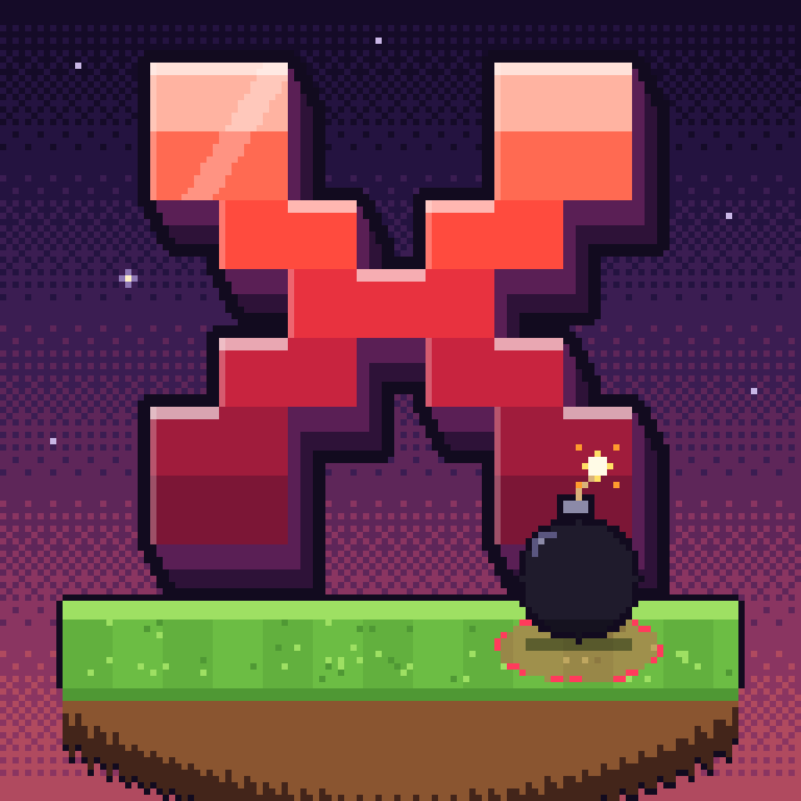
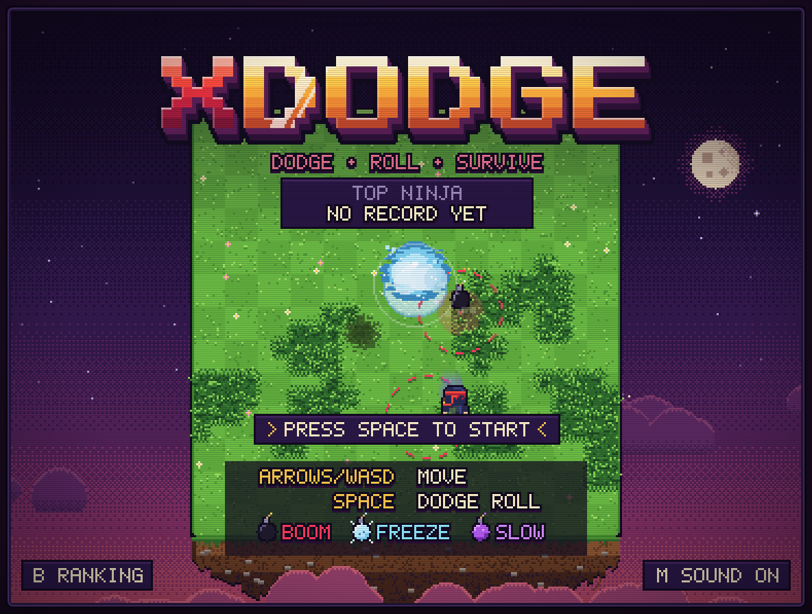
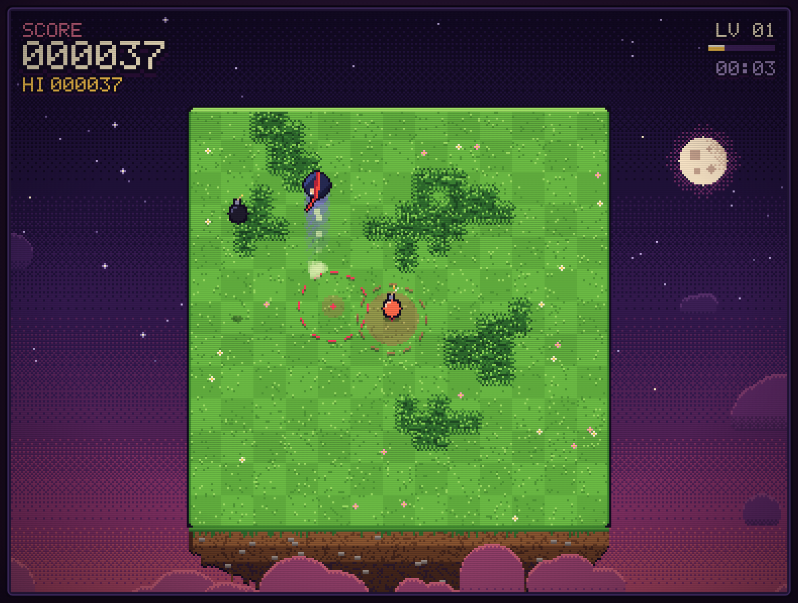
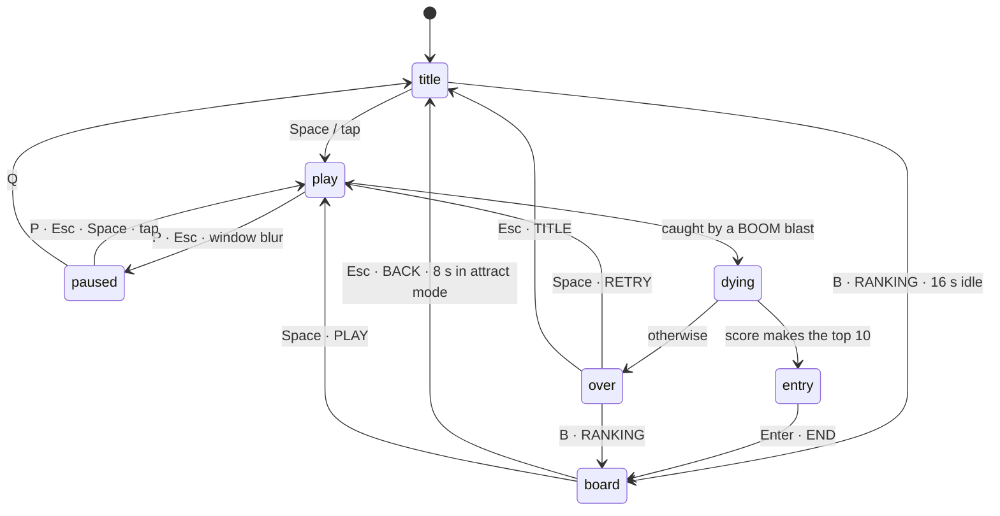

<div align="center">



# XDODGE

**Dodge. Roll. Survive.**<br>
A retro pixel-art arcade game: a ninja dodge-rolls across a floating pasture while bombs are lobbed in from every direction.


<br>


<br><br>




<sub>Left: the title screen, where the ninja plays itself in attract mode. Right: a dodge-roll in progress, with a bomb flashing just before it blows.</sub>

</div>

---

## Contents

- [Features](#-features)
- [Play it](#-play-it)
- [How to play](#-how-to-play)
- [Bombs](#-bombs)
- [Levels and difficulty](#-levels-and-difficulty)
- [Scoring and the combo multiplier](#-scoring-and-the-combo-multiplier)
- [Hall of Fame](#-hall-of-fame)
- [iOS app](#-ios-app)
- [Project layout](#-project-layout)
- [How it works](#-how-it-works)
- [Agent handoff](#-agent-handoff)

## ✨ Features

- **One file, zero dependencies.** [`xdodge.html`](xdodge.html) contains the entire game. There are no libraries, image files or network requests, and no build step.
- **No fonts anywhere.** Every letter and digit is drawn from hand-authored 5×7 bitmaps. The title logo uses its own chunky 7×7 face with banded color, a 3D extrusion and a periodic shine.
- **Everything is procedural pixel art.** That covers the ninja's run cycle, profile and back views, blinking, headband tails with physics and a spinning dodge-roll ball. The sky is a dithered dusk with a moon, twinkling stars and three parallax cloud layers.
- **Juice.** Screen shake, white flash frames, slow motion when you die, dust puffs, grass debris, sparks, smoke, and scorch marks that fade over time. Every sound effect is synthesized chiptune (Web Audio).
- **Three bomb types**, plus scripted attack patterns that unlock as the level rises.
- **A combo multiplier** for chaining perfect dodges: x2, then x5, then x20.
- **An arcade Hall of Fame** with a top-10 table and 3-letter initials, a "Top Ninja" plaque on the title screen, and an attract mode that cycles to the rankings.
- **Plays anywhere.** Keyboard, mouse and touch (drag to move, tap to roll). There is also a native **iOS app** with Game Center and haptics.

## 🎮 Play it

```sh
# no build step — just open it
start xdodge.html          # Windows
open xdodge.html           # macOS
```

Or serve the folder, for example with `python -m http.server`, and open `http://localhost:8000/xdodge.html`.

## 🕹 How to play

Survive as long as you can. Bombs arrive from every side, and each one marks its landing spot with a dashed circle the moment it's thrown. The circle fills in as the fuse burns, blinks, then turns solid white just before the blast. Get out of it, or **dodge-roll straight through the blast**, because a roll makes you briefly invincible.

| Action | Keyboard | Touch / mouse |
|---|---|---|
| Move | `←↑↓→` or `WASD` | Drag anywhere (a virtual stick; full speed at about 36 px) |
| Dodge roll | `Space` (also `J` / `K`) | Quick tap. A second finger also works while dragging |
| Break out of ice | Mash any move or roll key | Tap rapidly |
| Pause / resume | `P` or `Esc` (`Q` quits to the title) | Tapping resumes. The game also pauses itself when the window loses focus |
| Sound on / off | `M` | **SOUND** button on the title screen |
| Hall of Fame | `B` | **RANKING** button |
| Game Center (iOS) | `G` on the Hall of Fame | **GAME CENTER** button |

**The dodge roll** lasts 0.34 s at up to 210 px/s, slowing as it goes, against a walking speed of 82 px/s. You're **invincible from 0.02 s to 0.31 s** into the roll, and there's a 0.36 s cooldown afterwards, shown by a small bar under the ninja.

**Terrain:** the pasture is a square 208 px island. Dark **rough grass** patches, which are different every run, halve your walking speed and slow your roll. The effects of rough grass, slime puddles and being slimed multiply together, down to a floor of 22% speed.

## 💣 Bombs

| Bomb | Ring | If the blast catches you | Leaves behind |
|---|---|---|---|
| **BOOM** (black) | 🔴 red | **You die.** The run ends | A scorch mark (only cosmetic) |
| **ICE** (pale blue with frost spikes) | 🔵 cyan | **Frozen solid** for 1.5 s inside an ice block. Each mash chips off 0.1 s. Other bombs can still kill you | A **frost patch** for 7 s: low traction, so you slide, at 1.15× top speed |
| **SLIME** (purple jelly) | 🟣 violet | **Slimed** for 3.2 s: 60% move speed and 75% roll speed | **Goo puddles** for about 10 s (one big puddle and 3–4 small splats): 42% move speed and 60% roll speed |

- Only BOOM bombs (including big, ring and line bombs) can end your run. Ice and slime set you up for the next BOOM.
- Getting frozen or slimed **breaks your combo streak**, but rolling through their blasts counts as a perfect dodge, the same as with BOOM bombs.
- The first time a new bomb type appears in a run, a banner introduces it.
- The ice bomb's blast radius is 0.9× the current level's radius.

## 📈 Levels and difficulty

The level goes up **every 15 seconds** and never stops. Three values ramp per level (see `difficulty()` in the code): how often bombs come, how long fuses last, and how big blasts are.

| Level | Starts at | Time between throws* | Fuse after landing | Blast radius | Survival points / s | What's new |
|:-:|:-:|:-:|:-:|:-:|:-:|---|
| 1 | 0:00 | 1.20 s | 1.60 s | 17 px | 10 | Bombs aimed at where you're heading. **Slime** from 0:10 |
| 2 | 0:15 | 1.11 s | 1.52 s | 18 px | 12.5 | **Ice** bombs. **Scatter** volleys |
| 3 | 0:30 | 1.01 s | 1.44 s | 20 px | 15 | **SURROUNDED!** rings |
| 4 | 0:45 | 0.92 s | 1.36 s | 21 px | 17.5 | **Line** sweeps |
| 5 | 1:00 | 0.82 s | 1.28 s | 23 px | 20 | **Big** bombs |
| 6 | 1:15 | 0.73 s | 1.20 s | 24 px | 22.5 | |
| 7 | 1:30 | 0.63 s | 1.12 s | 25 px | 25 | |
| 8 | 1:45 | 0.54 s | 1.04 s | 27 px | 27.5 | Slime chance maxes out at 22% |
| 9 | 2:00 | 0.44 s | 0.96 s | 28 px | 30 | Ice chance maxes out at 22% |
| 10 | 2:15 | 0.35 s | 0.88 s | 30 px | 32.5 | |
| 11+ | 2:30 | **0.30 s** (min) | **0.80 s** (min) | 31 → **32 px** (max) | +2.5 per level | Maximum pressure. The score rate keeps climbing |

<sub>*Each gap is randomized between 0.8× and 1.2×, and patterns add their own pause afterwards. A bomb takes 0.85–1.15 s to fly in, so its total warning time is about flight time plus fuse. Survival points per second shown before the combo multiplier.</sub>

**Attack patterns.** Each throw rolls for a pattern. From level 5 on, the split is about **16% ring, 14% line, 15% scatter, 15% big, and 40% a single aimed bomb**.

| Pattern | Unlocks | What happens | How to survive |
|---|:-:|---|---|
| Aimed | 1 | One bomb aimed 0.25–0.75 s ahead of where you're moving, give or take 10 px | Change direction, or roll through it |
| Scatter | 2 | One aimed bomb plus 2–5 random ones across the field, staggered by up to 0.4 s | Read the circles and find the gap |
| SURROUNDED! | 3 | Six bombs land in a ring around you, 1.6 radii out. The centre is safe | **Stand still**, or roll out through a blast for a perfect. It only triggers when you aren't near an edge |
| Line | 4 | A row of bombs sweeps across the whole field through your row or column, one after another | Step off the line sideways |
| Big | 5 | One aimed bomb with a 1.65× radius, a longer fuse and a red cross painted on it | Run early |

Ice and slime can appear in aimed and scatter throws. Rings, lines and big bombs are always BOOM.

## 🏆 Scoring and the combo multiplier

| Source | Points |
|---|---|
| Surviving | `10 × (1 + 0.25 × (level − 1))` per second |
| **PERFECT**: a blast hits you mid-roll while you're invincible | `50 × level` |
| **CLOSE**: a blast lands within 10 px of catching you | `10 × level` |

Everything above is then **multiplied by your combo**:

| Perfects in a row | Multiplier | Banner |
|:-:|:-:|---|
| 2 | **×2** | `X2 COMBO!` |
| 5 | **×5** | `X5 COMBO!` |
| 20 | **×20** | `X20 NINJA MASTER!` (rainbow) |

The streak survives only while you keep landing perfects. **Go 7 seconds without one, or get frozen or slimed, and it resets to 0.** The top left of the screen shows the multiplier badge, `STREAK n/next` and a bar for the time left in the 7-second window. One roll through several overlapping blasts counts as several perfects.

## 👑 Hall of Fame

- A **top-10 table** saved on the device, with rank, name, score, level and time. The first three ranks are colored gold, silver and bronze.
- A qualifying score opens an **arcade initials entry**:
  - type letters, or use the on-screen letter grid with the arrow keys and `Space`, or tap it;
  - `Backspace` or **DEL** deletes a letter;
  - `Enter` or **END** saves.
  - Your last name is pre-filled; typing a new letter replaces it.
- The title screen shows the **TOP NINJA** plaque. After 16 idle seconds it switches to the Hall of Fame for 8 seconds, like an arcade cabinet.
- Stored in `localStorage` under `xdodge.board.v1` (the table) and `xdodge.name.v1` (your last initials). On first run, a high score saved by an older version (`xdodge.hi.v1`) moves into the table.
- In the iOS app, scores also go to **Game Center** when you're signed in.

## 📱 iOS app

[`ios/`](ios/) is a native **SwiftUI + WKWebView** wrapper, generated with XcodeGen. It bundles the same `xdodge.html` from the repo root at build time, so the web game stays the single source of truth.

```sh
brew install xcodegen
cd ios && xcodegen generate && open Xdodge.xcodeproj
```

- Landscape on iPhone, any orientation on iPad. The status bar and home indicator are hidden, the screen stays awake, and audio is `.ambient` (it respects the silent switch).
- **Game Center**: sign-in, score submission to leaderboard `xdodge.highscore`, and the native leaderboard sheet.
- **Haptics** for perfect dodges, combo tiers, freezes, slimes and deaths.
- The game pauses itself for Control Center, calls and Game Center sheets.

Signing, the App Store Connect leaderboard and TestFlight are covered in [`ios/README.md`](ios/README.md).

## 🗂 Project layout

```
.
├── xdodge.html                  # the entire game (HTML + CSS + JS, one file)
├── ios/                         # native iOS wrapper (XcodeGen)
│   ├── project.yml              # bundles ../xdodge.html as a resource
│   ├── README.md                # Mac build, Game Center, TestFlight
│   ├── icon/AppIcon.html        # source of the app icon (128 px canvas × 8)
│   └── Xdodge/
│       ├── XdodgeApp.swift          # @main, audio session, idle timer, GC sign-in
│       ├── GameViewController.swift # full-screen WKWebView host
│       ├── GameBridge.swift         # JS ⇄ native bridge + document-start script
│       ├── GameCenterManager.swift  # auth, submitScore, leaderboard sheet
│       ├── Xdodge.entitlements      # Game Center
│       └── Assets.xcassets/         # AppIcon (1024, opaque), LaunchBackground, AccentColor
├── _documentation/images/       # README screenshots
└── .gitignore                   # generated .xcodeproj / Info.plist, build output
```

## 🔧 How it works

Everything is drawn on a **384 × 288** canvas, then scaled up with CSS. Desktop uses whole-number scaling so the pixels stay crisp. Touch devices and the iOS app use fractional scaling to fill the screen.

### Screen flow



### Code map of `xdodge.html`

The script is one IIFE, split into sections that each start with a `/* ===== name ===== */` banner. Search for a banner to jump to that section.

| Section | What lives there |
|---|---|
| `core` | Canvas size (`W`, `H`), palette `P`, math helpers, `disc` / `line` / `ringPts`, Bayer dithering |
| `pixel font` | `F5` 5×7 glyph bitmaps, `putText()` (cached, outlined and drop-shadowed) |
| `title logo` | `L7` chunky glyphs, the `LOGO` pre-render and its shine sweep |
| `chiptune sfx` | `tone()`, `hiss()` (noise) and the `SFX.*` sounds. Audio starts on the first key press or tap |
| `input` | `keys` (held), `pressed` (this frame), the touch stick `TP`, tap position `TAP`, `inputVec()` |
| `world` | Platform geometry `PX, PY, PS`, rough-grass generation, pre-rendered ground and cliff face |
| `sky` | Dithered dusk, moon, stars, three parallax cloud layers |
| `the ninja` | `N` state, roll and invincibility window, frozen/slimed status, headband physics, procedural sprite with auto-outline |
| `bombs, blasts, particles` | `TYPE` table, `throwBomb`, `explode`, combo logic, hazards (frost/goo), particles, scorch marks, draw functions |
| `the bomb director` | `difficulty()`, `director()` patterns, `pickType()`, the title demo AI |
| `game state, leaderboard & screens` | `G` state, Hall of Fame storage, the native bridge `native()`, name entry, `update()`, every screen, `render()` |
| `loop & boot` | `fit()` scaling, the animation-frame loop, `start()` |

**Draw order each frame:** sky → clouds → island → scorch and hazards (clipped to the island) → target rings → grass tufts → shadows → landed bombs and the ninja, sorted by y → blasts → particles → bombs in flight → score popups → foreground clouds → HUD and screens.

<details>
<summary><b>Tuning knobs</b></summary>

| Knob | Where | Default | Effect |
|---|---|---|---|
| `ROLL_DUR`, `ROLL_SPD`, `ROLL_CD`, `MAXV` | the ninja | 0.34 s, 210, 0.36 s, 82 | Roll length, roll speed, roll cooldown, walking speed |
| `iframes()` | the ninja | 0.02 – 0.31 s | When during a roll you're invincible |
| `difficulty()` | the bomb director | see levels table | Throw interval, fuse and radius per level |
| `G.survive/15` | `update()` | 15 s | Length of a level |
| `pickType()` | the bomb director | 12% → 22% each | Slime and ice chances |
| `STREAK_WINDOW`, `mult()` | bombs section | 7 s; 2 / 5 / 20 | How long a streak lasts; multiplier tiers |
| `freezeNinja()`, `slimeNinja()` | bombs section | 1.5 s, 3.2 s | How long status effects last |
| `addHazard(...)` calls in `explode()` | bombs section | frost 7 s, goo about 10 s | How long ground hazards last, and their size |
| Slow factors in `ninjaUpdate()` | the ninja | rough 0.5, goo 0.42, slimed 0.6, floor 0.22 | Terrain penalties |

</details>

<details>
<summary><b>JS ⇄ iOS bridge contract</b></summary>

| Direction | Message |
|---|---|
| JS → native | `native({type:'score', value})` is sent when you die |
| | `native({type:'showLeaderboard'})` is sent by the GAME CENTER button |
| | `native({type:'haptic', style:'light'\|'medium'\|'heavy'\|'success'\|'error'})` |
| native → JS | `window.xdodgeNative = {platform:'ios', version}` is set before the page's script runs |
| | A `window` event `xdodge-native` with `detail {type:'gc', ok, name}`, sent on each page load and each sign-in change |
| | A synthetic `blur` event pauses the game |

`native()` is a no-op in a normal browser.

</details>

## 🤝 Agent handoff

> Context for the next person or agent picking this up.

### Status

| | Item |
|:-:|---|
| ✅ | The game is complete: title and attract mode, one endless level, three bomb types, patterns, combo multiplier, Hall of Fame, pause, sound, touch |
| ✅ | The iOS wrapper is written: XcodeGen project, Game Center bridge, haptics, a 1024 px opaque app icon |
| ⚠️ | **No person has playtested the balance yet.** Verification so far is only headless-browser screenshots |
| ⚠️ | **The Swift has never been compiled.** It's developed on Windows, and the owner builds on a Mac and reports compiler errors |
| ⏳ | **Not yet pushed to GitHub.** The remote `eisenjimmy/xdodge` isn't reachable with the credentials on the dev machine. The commits are local on `main` |
| ⏳ | App Store Connect: the Team ID in `ios/project.yml` and the `xdodge.highscore` leaderboard still need setting up |

### House rules

- **Keep it one self-contained file.** No libraries, CDNs, image files or web fonts.
- **Never use a font.** All text goes through `putText()` and the `F5` glyphs. The owner requires this.
- Match the existing style: dense lines, few comments, no blank-line padding, and descriptive function names.
- Draw on whole pixels at 384×288 (`imageSmoothingEnabled = false`), and take colors from `P` rather than new hex literals.

### Gotchas

1. **Only glyphs defined in `F5` render.** That's `A–Z 0–9 : ! . - / + ? > < *` and space. Lowercase is shown as uppercase, and any other character (`= _ , ' %`) is **silently dropped**. Add a bitmap to `F5` before using a new character.
2. `hit(...)` means pressed this frame and `down(...)` means held. `pressed` is cleared at the end of every frame. A `Tap` carries `TAP.x` / `TAP.y` in canvas coordinates.
3. Buttons are hit-tested in `update()` and drawn in `render()`. Always get their rectangles from the shared helpers (`BTN`, `boardButtons()`, `overButtons()`, `gridCell()`) so the two stay in sync.
4. **Only the `play` state can hurt the ninja** (`explode()` checks `G.state`). The title and attract screens reuse the real bomb system with a demo AI.
5. `localStorage` keys end in `.v1`. Bump the suffix if the stored format changes, and every access is already wrapped in try/catch.
6. **iOS:** never copy `xdodge.html` into `ios/`, because XcodeGen bundles `../xdodge.html`. Run `xcodegen generate` after adding Swift files or editing `project.yml`.
7. On Windows, git prints LF → CRLF warnings. They're expected; the repo stores LF.
8. **Headless screenshots:** headless Chrome/Edge doesn't advance the animation-frame loop, so a plain `--screenshot` only captures the first frame. To capture later frames, inject a timer-driven replacement and give it virtual time:
   ```html
   <!-- inserted right after <head> in a scratch copy -->
   <script>window.requestAnimationFrame=cb=>setTimeout(()=>cb(performance.now()),16);</script>
   ```
   ```sh
   msedge --headless=new --window-size=1184,896 --virtual-time-budget=4800 --screenshot=out.png scratch.html
   ```
   To drive gameplay, dispatch `new KeyboardEvent('keydown',{code:'Space'})` on `window` from timers.

### Suggested next steps

1. Push to GitHub, and optionally turn on **GitHub Pages** so the game is playable at `…github.io/xdodge/xdodge.html`.
2. Build on a device from the Mac, fix any compiler errors, then check the scale, that scores persist, and that pausing works.
3. Playtest and tune `difficulty()`, the pattern mix and the streak window.
4. Ideas:
   - an on-screen pause button for touch;
   - Gamepad API support;
   - a looping chiptune soundtrack;
   - more stages, such as a shrinking platform or moving hazards;
   - a global web leaderboard, which would need a backend;
   - a LICENSE file.

---

<div align="center">
<sub>Made by <b>Jimmy Park</b> (<a href="https://github.com/eisenjimmy">@eisenjimmy</a>), with Claude Code.</sub>
</div>
